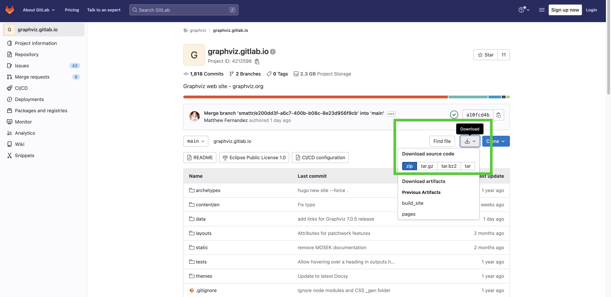

Deploying [graphviz.github.io (fork)](https://github.com/QubitPi/graphviz.github.io) to GitHub Pages
----------------------------------------------------------------------------------------------------

> [**First-Time ONLY**](https://github.com/google/docsy/issues/235#issuecomment-605769523)
> 
> ```bash
> git clone git@github.com:QubitPi/graphviz.github.io.git
> cd graphviz.github.io
> 
> npm install -g postcss-cli
> npm install autoprefixer
> npm audit fix
> ```

The documentation was written and served in [Hugo](https://gohugo.io/). Navigate to the repo's root directory and
generate static site using:

```bash
git submodule update --init --recursive
hugo
```

A gh-pages deployable, including `index.html`, will be under **./public** directory.

This fork publishes documentation to [`gh-pages`](https://pages.github.com/) branch under `/docs` directory. Simply
rename the **./public** to **./doc**:

```bash
rm -rf docs
mv ./public docs
```

and push everything to `gh-pages` branch.

### Syncing [this Fork](https://github.com/QubitPi/graphviz.github.io) with [Upstream on GitLab](https://gitlab.com/graphviz/graphviz.gitlab.io)

**First of all, I hate GitLab, A LOT**

Fork syncing between GitHub and GitLab throws an error like the following:

```bash
$ git pull upstream main -v
Looking up gitlab.com ... done.
Connecting to gitlab.com (port xxxx) ... xxx.xxx.xxx.xxx done.
fatal: read error: Connection reset by peer
```

I don't know if it's Graphviz or GitLab's problem, but I never saw this embarrassing and stupid situation, so I decided
to detach this fork completely from the upstream (although I DO still declare this repo to be a _fork_ for clarification 
purpose). 

Code updates are checked-in to **origin/master** branch **manually** by downloading source code directly from
[upstream](https://gitlab.com/graphviz/graphviz.gitlab.io):



Next the `gh-pages` branch will **rebase** on top of `master` branch.

---

# Graphviz Docs

This is the documentation repository for https://graphviz.org, the GraphViz
Graph Visualization Software.

Docs are built from Markdown using the [Hugo](https://gohugo.io/) static
site generator and the [Docsy](https://www.docsy.dev/) technical documentation
theme.

There are a few ways to contribute, ranging from simple to most complex:

## Easiest: Contributing Simple One-Page Fixes

Most pages on https://graphviz.org/ have an "Edit this page" link at the
top-right, which opens the GitLab file editor.

## Moderately Complex Multi-File Changes

Use [GitLab's Web
IDE](https://gitlab.com/-/ide/project/graphviz/graphviz.gitlab.io/edit/main/-/)
if you need to upload files (e.g. images under `static/doc`) or edit multiple
files at once.

Commit your change with `Commit...` and create a merge request.

## Complex Changes: Serving the Docs Locally During Development

For the most complex changes, you'll want to copy the repository to your local
machine for development. Here's how:

### Install Hugo (Static Site Generator Framework)

* Download a recent **extended** edition of Hugo (Graphviz's doc requires SCSS,
  only present in the extended edition) from
  https://github.com/gohugoio/hugo/releases. You may need to scroll down the
  list of releases to see the extended edition.
  
  * macOS users can install with Homebrew: `brew install hugo`
  * Ubuntu 19.04 users can install with apt: `sudo apt install hugo`

### Install Git

https://git-scm.com/downloads

### Clone the Graphviz Docs

[Fork a copy of the Graphviz docs
repo](https://gitlab.com/graphviz/graphviz.gitlab.io/-/forks/new) on GitLab.

* Clone your new Git repo (replace `<username>` with your GitLab username):

  ```shell
  $ git clone https://gitlab.com/<username>/graphviz.gitlab.io.git
  $ cd graphviz.gitlab.io
  ```

* Download the Docsy theme dependencies:

  ```shell
  $ git submodule update --init --recursive
  ```

### Create a development branch

```
$ git checkout -b my-branch
```

### Run the development server

* Run `hugo serve` to start the local web server.

* Open the site at http://localhost:1313/ in your browser.

Detailed instructions for how to run Docsy locally are at [Docsy's Getting
Started page](https://www.docsy.dev/docs/getting-started/).

### Edit the files

As you edit, the site should re-compile automatically. Reloading the browser
should show the new site output.

### Create a merge request

Make a commit of your changes, giving them a message:

```shell
$ git commit --all -m "replace me with a descriptive commit message"
$ git push origin my-branch
```

The `git push` command will print a URL. Open that URL to create a Merge
Request in the GitLab UI.

### Get a review

A maintainer should review the change within a few days, and merge it into the
mainline. Once merged, your change will be live on graphviz.org within minutes.
